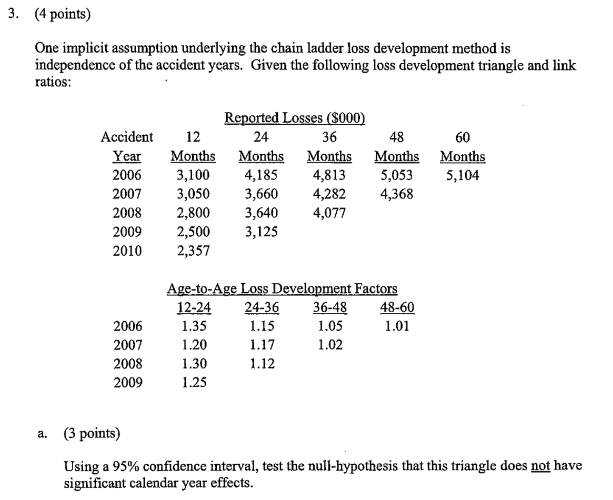
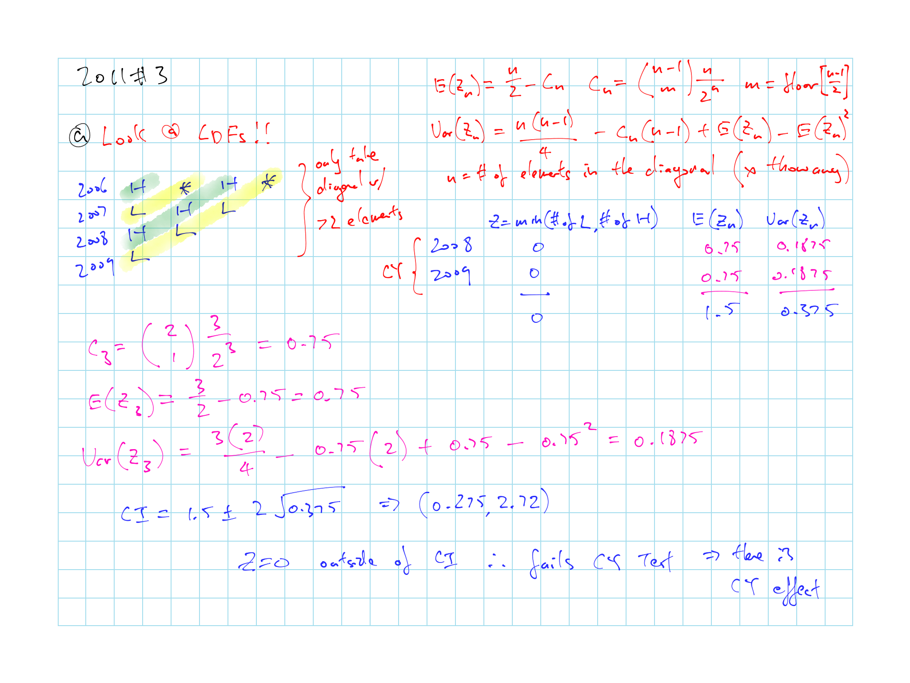
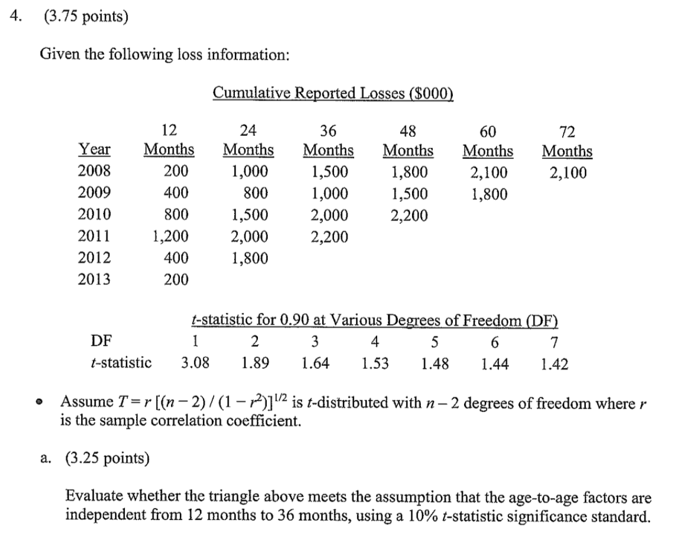

# A6 Measuring the Variability of Chain Ladder Reserve Estimate - T. Mack

## Cliff's Summary

Know the 3 **assumptions** of [chain ladder](#cl-ass)

Know the 3 different **weight and variance** assumptions

| Weight $w_{j,k}$ | Description | Variance | Residual |
| ---------------- | ----------- | -------- | -------- |
| 1                | Simple Average | $\alpha_k^2 \times \mathbf{c_{j,k}^2}$ | $\varepsilon = \dfrac{c_{j,k+1} - c_{j,k} \: \hat{f_k}}{\sqrt{\mathbf{c_{j,k}^2}}}$ |
| $c_{j,k}$        | Weighted Average | $\alpha_k^2 \times \mathbf{c_{j,k}}$ | $\varepsilon = \dfrac{c_{j,k+1} - c_{j,k} \: \hat{f_k}}{\sqrt{\mathbf{c_{j,k}}}}$ |
| $c_{j,k}^2$      | Least Square | $\alpha_k^2 \times \mathbf{1}$ | $\varepsilon = \dfrac{c_{j,k+1} - c_{j,k} \: \hat{f_k}}{\sqrt{\mathbf{1}}}$ |

**Mean squared error** calculation

$\begin{align}
  MSE(\hat{c}_{i,I}) = \hat{c}_{i,I}^2 \Bigg \{ \sum_{k = I + 1 - i}^{I-1} \frac{\hat{\alpha}_k^2}{\hat{f_k}^2} \Bigg ( \frac{1}{\hat{c}_{i,k}} + \underbrace{\frac{1}{\sum_{j=1}^{I-k}c_{j,k}}}_{\text{Column x latest}}\Bigg ) \Bigg \}
\end{align}$

$\begin{align}
  \hat{\alpha}_k^2 = \frac{1}{I - k - 1} \sum_{j=1}^{I-k} c_{j,k} \Big ( \underbrace{\frac{c_{j,k+1}}{c_{j,k}}-\hat{f_k}}_{\text{AY LDFs - Selected}} \Big )^2
\end{align}$

$\hat{\alpha}_{I-1}^2 = \operatorname{min} \left( \dfrac{(\hat{\alpha}_{I-2}^2)^2}{\hat{\alpha}_{I-3}^2},\hat{\alpha}_{I-3}^2 \right) = \begin{cases}
  \hat{\alpha}_{I-3}^2 & \text{if } \hat{\alpha}_{I-3}^2 < \hat{\alpha}_{I-2}^2 \\
  \hat{\alpha}_{I-2}^2 \times \dfrac{\hat{\alpha}_{I-2}^2}{\hat{\alpha}_{I-3}^2} & \text{else}\\
\end{cases}$

**Confidence Interval**

* [Normal](#ci-normal)
* [Log-normal](#ci-log-normal)

Know the 4 **test of assumptions**

Test 1. Intercept

Test 2. [Residuals](#residuals)

Test 3. [CY Test](#cy-test)

* Rank small and large
    
* $\operatorname{E}[z_n] = \dfrac{n}{2} - c_n$
    
    * $c_n = {n - 1 \choose m}\frac{n}{2^n}$
        
    * $m = \operatorname{floor}\left[ \dfrac{n-1}{2} \right]$

* $\operatorname{Var}(z_n) = \dfrac{n(n-1)}{4} - c_n (n-1) + \operatorname{E}[Z_n] - \operatorname{E}[z_n]^2$
    
* $Z = \sum_{diagonal} z$

* Since $Z \sim$ Normal, can sum the mean and variance assuming $\perp\!\!\!\perp$

* Test 95% CI: $\operatorname{E}[Z] \pm 2 \times \sigma$

Test 4. [Adjacent LDF Correlation](#adjacent-ldf)

* $S = \sum \limits_{\in rows} \Big \{ [Rank \: Col \: i \: LDF] - [Rank \: Col \: j \: LDF] \Big \}^2$

* $T_k = 1 - \dfrac{S}{n(n^2-1)/6}$
    
* $T = \dfrac{\sum T_k (n_k - 1)}{\sum (n_k-1)} = \dfrac{\sum_k (I - k -1)T_k}{\sum_k I - k -1}$

* $\operatorname{E}[T] \pm Z \sqrt{\operatorname{Var}(T)}$

    * $\operatorname{E}[T] = 0$

    * $\operatorname{Var}[T] = \dfrac{1}{(I-2)(I-3)/2}$

* Use $Z = 0.67$ for range of [25%, 75%]

### Types of Exam Questions

Haven't done TIA practice questions

Not historical questions on the MSE yet

**Concepts**

* 2011 #3 b: CL method assumptions
* 2012 #5: CL assumptions and whether they are met
* 2014 #2: CL assumptions on intercept and residuals
* 2014 #4 b: CL LS assumptions

**Assumption test**

* $\star$ [2011 #3 a](#2011-3): CY Test
* 2013 #3: Residuals test
* 2013 #1: CY test and potential cause
* $\star$ [2014 #4 a](#2014-4): Adjacent LDFs correlation test
    * Has to use method from Venter?
* 2015 #3: Residuals test and plot, remember to label them
* 2015 #4: CY Test

## Chain Ladder Assumptions

**Definitions**

$c_{i,k} =$ cumulative losses for AY $i$ @ age $k$

$f_k =$ LDF from $k$ to $k + 1$

<a name="cl-ass"><a/>**3 + 1 Assumptions**

1) $\operatorname{E}\left [c_{i,k+1} \mid c_{i,1} \cdots c_{i,k}\right ] = c_{i,k} \: f_k$

    * Expected incremental losses are $\propto$ losses reported to date
    
    * Proportion depends on the age of AY
    
2) $\left \{c_{i,1} \cdots c_{i,I} \right \} \: {\perp\!\!\!\perp} \: \left \{c_{j,1} \cdots c_{j,I} \right \}$ for $i \neq\ j$

    * Losses in each AYs are ${\perp\!\!\!\perp}$ of the losses in other AYs
    
    * $I =$ size of the triangle
    
    * This assumption make our estimate unbiased
    
3) $\operatorname{Var}\left (c_{i,k+1} \mid c_{i,1} \cdots c_{i,k}\right ) = \alpha_k^2 \: c_{i,k}$

    * Variance of the incremental losses is $\propto$ losses reported to date
    
    * Proportion depends on the age of AY
    
    * $\hat{f}_k$ is selected to minimize the variance
    
4) = (1) & (3) Variance is $\propto$ mean

    * If variance follows distribution x, then it implies the variance is $\propto$ loss

## LDF Selections Assumptions

$\begin{align}
  \hat{f_k} = \frac{\sum_j \overbrace{\frac{c_{j,k+1}}{c_{j,k}}}^{LDF_j} \: w_{j,k}}{\sum_j w_{j,k}}
  \end{align}$

| Weight $w_{j,k}$ | Description | Variance | Residual |
| ---------------- | ----------- | -------- | -------- |
| 1                | Simple Average | $\alpha_k^2 \times \mathbf{c_{j,k}^2}$ | $\varepsilon = \dfrac{c_{j,k+1} - c_{j,k} \: \hat{f_k}}{\sqrt{\mathbf{c_{j,k}^2}}}$ |
| $c_{j,k}$        | Weighted Average | $\alpha_k^2 \times \mathbf{c_{j,k}}$ | $\varepsilon = \dfrac{c_{j,k+1} - c_{j,k} \: \hat{f_k}}{\sqrt{\mathbf{c_{j,k}}}}$ |
| $c_{j,k}^2$      | Least Square | $\alpha_k^2 \times \mathbf{1}$ | $\varepsilon = \dfrac{c_{j,k+1} - c_{j,k} \: \hat{f_k}}{\sqrt{\mathbf{1}}}$ |

* Use different method for LDF selection based on variance assumption

* Variance and the weight always multiply to $c_{j,k}^2$

## Mean Squared Error

Important Formulas

$\begin{align}
  MSE(\hat{c}_{i,I}) = \operatorname{E}[(c_{i,I}-\hat{c}_{i,I})^2 \mid D]
  \end{align}$

* Average error between estimate and actual given data $D$

* Standard error: $s.e. = \sqrt{MSE}$

$\begin{align}
  MSE(\hat{c}_{i,I}) = \hat{c}_{i,I}^2 \Bigg \{ \sum_{k = I + 1 - i}^{I-1} \frac{\hat{\alpha}_k^2}{\hat{f_k}^2} \Bigg ( \frac{1}{\hat{c}_{i,k}} + \underbrace{\frac{1}{\sum_{j=1}^{I-k}c_{j,k}}}_{\text{Column x latest}}\Bigg ) \Bigg \}
\end{align}$

* The big $\sum$ sum over the remaining years till ultimate

* For bit outside the $\sum$ is same for the row

Proportions for the variance

$\begin{align}
  \hat{\alpha}_k^2 = \frac{1}{I - k - 1} \sum_{j=1}^{I-k} c_{j,k} \Big ( \underbrace{\frac{c_{j,k+1}}{c_{j,k}}-\hat{f_k}}_{\text{AY LDFs - Selected}} \Big )^2
\end{align}$

$\hat{\alpha}_{I-1}^2 = \operatorname{min} \left( \dfrac{(\hat{\alpha}_{I-2}^2)^2}{\hat{\alpha}_{I-3}^2},\hat{\alpha}_{I-3}^2 \right) = \begin{cases}
  \hat{\alpha}_{I-3}^2 & \text{if } \hat{\alpha}_{I-3}^2 < \hat{\alpha}_{I-2}^2 \\
  \hat{\alpha}_{I-2}^2 \times \dfrac{\hat{\alpha}_{I-2}^2}{\hat{\alpha}_{I-3}^2} & \text{else}\\
\end{cases}$

* This one varies by age (columns), for each age:

    1. Calculate the difference^2^ of the LDFs for each AY and the selected
    2. Then multiply by each row's respective cumulative loss for that age
    3. Sum the above and then divide by the number of rows minus 1

* For the last one:

    * If the 3rd last one is lower, take that
    
    * Else, you take the 2nd last times the ratio of the 2nd last to 3rd last
    
## Confidence Intervals

Can have different assumptions on the distribution of the unpaid

Formulas applies to total reserve as well

  * Need $MSE(\hat{R})$
  
  * Correlate the individual $\hat{R}_i$'s. Because we use the same LDFs to forecast the estimates
  
  * Can just use the square root rule to sum up the different AYs if we assume independence

**Normal**

$\hat{R}_i \pm Z_\alpha \: s.e.(\hat{R}_i)$

**LogNormal**

Memorize Formulas

$R_i \operatorname{exp}\left \{ -\dfrac{\sigma_i^2}{2} \pm \: Z_\alpha \sigma_i \right \}$

* $\sigma_i^2 = \operatorname{ln} \left [ 1 + \left ( \dfrac{s.e.(\hat{R}_i)}{\hat{R}_i} \right)^2 \right]$

* $\mu_i = \operatorname{ln}(\hat{R}_i) - \dfrac{\sigma_i^2}{2}$

## Chain Ladder Assumptions Test

Look at various test on the Chain Ladder assumptions

### Intercept

Test for assumption (1)

Plot the losses at adjacent ages to see if the line of best fit goes through the origin

### Residuals

Test for assumption (1)

For each age $k$, graph the $c_{i,k}$ with the residuals $\varepsilon_{i,k}$

* $\varepsilon = \dfrac{c_{j,k+1} - c_{j,k} \: \hat{f_k}}{\sqrt{\operatorname{Var}(c_{j,k})}}$

* e.g. $\varepsilon = \dfrac{c_{j,k+1} - c_{j,k} \: \hat{f_k}}{\sqrt{c_{j,k}}}$ for the variance of the incremental losses is $\propto$ losses reported to date scenarios; Proportional term doesn't affect the variance since it's the same for the column

* For residuals @ t, you need LDFs from t-1 to t

* They should vary randomly around zero

* If passed $\Rightarrow$ expected losses are linear w.r.t. cumulative losses paid to date

* Can also use to test assumption (3) on the other variance assumption by calculating the $\varepsilon$ differently

### Calendar Year Test

Test for assumption (2)

Step 1) Rank the LDFs in each column

Step 2) Label them S and L and the median is discarded

Step 3) For each diagonal with at least 2 elements, $z = \operatorname{min}(\text{# of S}, \text{# of L})$

Step 4) Calculate $\operatorname{E}[z_n]$ and $\operatorname{Var}(z_n)$

* $\operatorname{E}[z_n] = \dfrac{n}{2} - c_n$ Memorize Formulas

    * $n =$ # of elements in each diagonal **excluding** the throw away value
    
    * $c_n = {n - 1 \choose m}\frac{n}{2^n}$
    
    * $m = \operatorname{floor}\left[ \dfrac{n-1}{2} \right]$

* $\operatorname{Var}(z_n) = \dfrac{n(n-1)}{4} - c_n (n-1) + \operatorname{E}[Z_n] - \operatorname{E}[z_n]^2$ Memorize Formulas

* $z \sim$ Normal

Step 5) See if $Z$ is in the CI based on the the above

* $Z = \sum_{diagonal} z$

* Since $Z \sim$ Normal, can sum the mean and variance by assuming independence

* Test 95% CI: $\operatorname{E}[Z] \pm 2 \times \sigma$

* If the observed is outside the range $\Rightarrow$ There is calendar year effects, fail assumption (2)

CY effect can be caused by changing or high inflation; change in claims handling; change in legal environment

### Correlation of Adjacent LDFs

Test assumption (1) where expected only depends on most recent

Use a relatively low threshold of 50%

Step 1) Calculate Spearman's correlation for each pair of adjacent LDFs

Memorize Formulas

* $S = \sum \limits_{\in rows} \Big \{ [Rank \: Col \: i \: LDF] - [Rank \: Col \: j \: LDF] \Big \}^2$

* Rank from low to high (i.e. lowest is 1)

* $T_k = 1 - \dfrac{S}{n(n^2-1)/6}$

    * $n =$ # of rows
    
    * For a 10 x 10 triangle, $k$ is at most 7 because there's only 9 LDFs so 8 pairs. And down to 7 because we don't use the pair with only 1 row
    
Step 2) Calculate $T$ for the whole triangle

Memorize Formulas

* $T = \dfrac{\sum T_k (n_k - 1)}{\sum (n_k-1)} = \dfrac{\sum_k (I - k -1)T_k}{\sum_k I - k -1}$

    * $I =$ size of triangle
    
    * $k$ starts at 2
    
    * Formula gives more weight to $T_k$ with more data
    
Step 3) Compare $T$ with CI based on distribution

Memorize Formulas

* $\operatorname{E}[T] = 0$

* $\operatorname{Var}[T] = \dfrac{1}{(I-2)(I-3)/2}$

* $\operatorname{E}[T] \pm Z \sqrt{\operatorname{Var}(T)}$

* Use $Z = 0.67$ for range of [25%, 75%]

* Do not reject the $H_0$ of uncorrelated LDFs if the $T$ is in the CI

Venter has a method too

## Past Exam Questions

