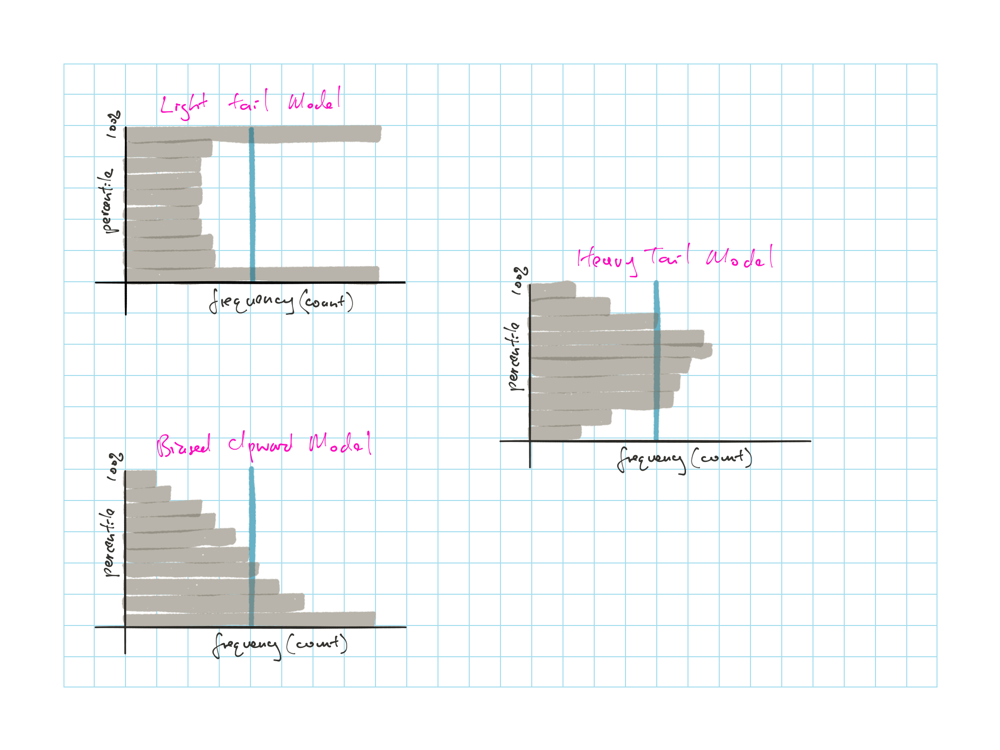
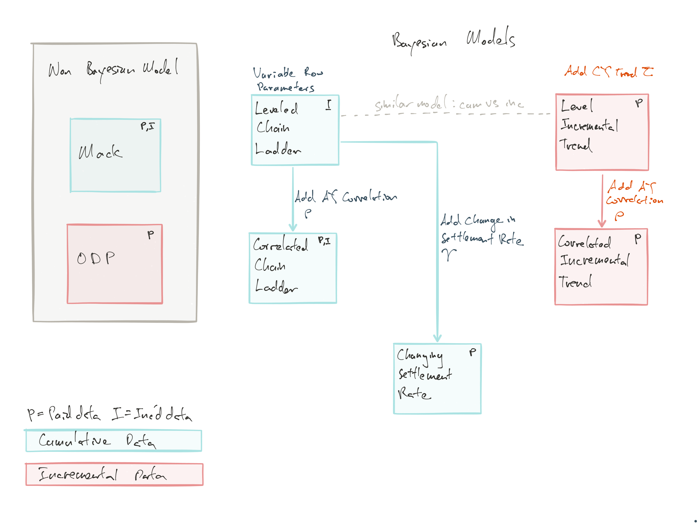

# A14 Stochastic Loss Reserving Using Bayesian MCMC Models - G. Meyer

## Cliff's Summary

Know how to read KS-test, $p-p$ plot and Freq vs Count plot

Know the form of all the methods in the model

### Types of Exam Questions

n/a

## Introduction & Synopsis

Estimate from Mack and ODP do not have enough variability

Incurred losses with variable row parameters and AY correlation $\rho$ is sufficient

Paid losses requires variable row parameters and change in settlement rate parameter $\gamma$

Two reasons model doesn't fit:

1) Insurance loss environment has experienced changes that are not observable at the valuation date
2) Other models can validate

If we review many models and none of them validate it gives 1) credence but does not confirm

## Data Set

200 triangles from Sch P 1997 and reviewed 10 years later

* Paid and incurred

* 50 triangles from 4 LoB (Commercial Auto, Personal Auto, WC, Other Liab)

**Potential pitfalls** in sample triangle selections

1) Insurer with significant changes to their books over the exposure period would violate the assumptions of the model and should be excluded

    * **Solution**: Use consisteny of NEP and Net:Gross Premium to establish stability in book
    * Use CoV to establish consistency
    * Pick triangles with CoV below a threshold

2) Need to avoid selecting datasets that best suit the model e.g. removing "outliers" from the data

    * **Solution**: Choose the company in an automated and well defined manner

Losses are considered fully developed at 10 years so in practice the paid and incurred ultimate is slightly different

## Testing Procedure

We are testing the procedure of each method and not the results of any one distribution generated from the method

* Generate 50 sets of distribution and determine the actual percentile based on the predicted distribution

* The distribution of the 50 predicted percentiles ($p_i$) should follow a uniform distribution if the model is accurate

    * Expected percentiles $e_i$ run from $\frac{1}{n+1}$ to $\frac{n}{n+1}$

### Kolmogorov-Smirnov Test

$H_0$: Distribution of $p_i$ is uniform

$D = \operatorname{max} \limits_i \mid p_i - e_i \mid$

* Maximum difference between the predicted and expected percentiles

Reject $H_0$ if $D > \dfrac{136}{\sqrt{n}}\%$ @5% confidence level

* e.g. for $n = 50$: 19.2%; $n=200$: 9.6%

Anderson-Darling focuses on the tail and failed all the models therefore we do not use it as it does not help in model comparison

### *p-p* Plot

We plot the $p-p$ plot with $e_i$ vs $p_i$ to diagnosis

Light blueline is the critical value for a given $n$

* Model is too light tailed: Shallow slope near corner and steep in the middle
* Model is too heavy tailed: Steep slope near corner and shallow in the middle
* Model is biased upwards: Bow down

### frequency vs percentile

* Blue line is based on the uniform $e_i$ set at $\frac{n}{10}$ for the 10 deciles

## Models Comparison Summary

* Mack is the only one that does not have a base form of $\mu_{wd} = \alpha_w + \beta_d$
* ODP is the England & Verall Bootstrap

### Mack Model

Variance is the product of mean in the cell and a constant that varies by column $\operatorname{Var}\left (c_{i,k+1} \mid c_{i,1} \cdots c_{i,k}\right ) = \alpha_k^2 \: c_{i,k}$

**Incurred**

Light on both tail $\Rightarrow$ Does not have enough variability in it's predicted distribution

**Paid**

Similar to ODP, biased high on personal auto and light left tail on WC

### ODP Bootstrap

EV ODP forecasts log incremental losses $\Rightarrow$ Only suitable for paid losses

* Can handle occasional negative losses as long as the $\sum$ column is positive

Same procedure as Shapland Leong paper

Overall shows biased high

## Bayesian Models (Cumulative)

**Inputs**

Prior distribution is needed for each parameters

* **Wide** priors (diffuse)
* **Narrow** priors: Use expert knowledge in selecting mean and variance of the parameters

Parameters:

* $\alpha_w$: row parameters
* $\beta_d$: column parameters
* $\sigma_d$: variance parameters (mostly constant across columns)
* $\tau$: trend
* $\gamma$: change in closure rate

Data: Paid or incurred Triangle

**Output**

The posterior distribution of the parameters is expressed as simulated outputs (not closed form distribution)

### Leveled Chain Ladder

LCL with incurred data

**Multiplicative** model (based on additive exponential)

Each cell is $e^{\mu_{wd}} = e^{\alpha_w}e^{\beta_d}$

* Log mean of each cell is $\mu_{wd} = \alpha_w + \beta_d$

* $\beta_{10} = 0$ so we have 100% at 10 years

* $\beta_d < 0$ most of the time, represents % paid to date

Uses **cumulative** data $C_{wd}$

Same variance parameter ($\sigma_d$) for each column of *cumulative* loss

$\hookrightarrow$ Highest variability @ early ages $\sigma_1 > \sigma_2 > \cdots > \sigma_{10}$

* Variance varies by column only (not by AYs)

$\alpha_w$ is a random variable

* Not value on the diagonal (incurred to date)
* Model select an $\alpha_w$ for each instance of the simulation based on wide priors
* Main feature of this model for adding variability

Can compare the variability (s.d.) with Mack by plotting the log(s.d.) of the 2 models

Model still does not capture the tail appropriately

### Correlated Chain-Ladder

Build upon the Leveled Chain-Ladder by adding $\rho$ to create correlation of losses in one AY and the **previous** AY

Uses **cumulative** data $C_{wd}$

$\mu_{wd} = \alpha_w + \beta_p + \rho \cdot \left[ \operatorname{ln}\left(C_{w-1, d}\right) - \mu_{w-1,d} \right]$

* Higher losses in one row $\rightarrow$ higher expected losses in the following row

* Prior is still wide priors

* The correlation here is what drives the additional variability

**Incurred**

Results and k-s test show that this model is sufficient

**Paid**

Worst than ODP and Mack, biased high for all lines

### Changing Settlement Rate

Based on LCL with $\gamma$ that allows for speed up in claim payments

Uses **cumulative** losses

Logmean for each cell:  
$\mu_{wd} = \alpha_w + \left[ \beta_d \cdot (1-\gamma)^{w-1}\right]$

$\gamma >0$ reflects increase in payment speed as $(1-\gamma)^{w-1} < 1$

$\gamma$ has less impact further out in the tail as there are less payments happening out there

Model fits one $\gamma$ for the whole triangle

**Results**

Overall fits well, slightly biased high on Personal Auto but is a big improvement over the other models

## Skewed Distribution

Use incremental data as trends act on incremental loss, which has the following properties:

* Skewed right
* Occasionally negative

### Skewed Normal Distribution

Blend of normal and truncated normal

$X = \mu + (\omega \cdot Z) \cdot \delta + (\omega \cdot \varepsilon) \cdot \sqrt{1 - \delta^2}$

* $\varepsilon \sim Normal(0,1)$

* $Z \sim Truncated \: Normal_{[0,\infty]} (0,1)$

* $\delta$ is the weight between $\varepsilon$ and $Z$

* $\omega$ is the standard deviation

Skewness = 0.995; Not used by the Meyers as it is not skewed enough

### Mixed Lognormal-Normal

$X \sim Normal(Z,\delta)$

* $Z \sim Lognormal(\mu,\sigma)$

* Mixed $ln - n$ Distribution

This can create distribution more skew than the skewed normal and can also have negative values

## Bayesian Models (Incremental)

Model applies trend and therefore uses incremental data

Correlated Incremental Trend Model

Changing Settlement Rate Model

### Correlated Incremental Trend

Single CY trend parameter $\tau$

* Mixed lognormal-normal distribution

Include correlation between AY similar to CCL method

Steps for the method:

1) Uncorrelated log mean of each cell with CY trend  
$\mu_{wd} = \alpha_w + \beta_d + \tau \cdot(w+d-1)$

2) Draw $Z_{wd} \sim Lognormal(\mu_{wd},\sigma_d)$

    * $\sigma_1 > \sigma_2 > \cdots > \sigma_{10}$
    
    * Smaller less volatile claims should be settled early

3) $\tilde{I}_{wd} \sim Normal(Z_{wd},\delta)$

4) Add correlation between AYs for rows after the first  
$\tilde{I}_{wd} \sim Normal(Z_{wd} + \rho \cdot (\tilde{I}_{w-1,d} - Z_{w-1,d})\cdot e^{\tau},\delta)$

**Parameters restrictions**

$\tau$:

* Prior $\sim Normal(0,3.2%)$
* Without restriction it was forecasting very negative trend which is offset by higher $\alpha$ and $\beta$

$\sigma_d$:

* Prior $\sigma_1 \sim Uniform(0,0.5)$
* Prior $\sigma_d \sim Uniform(\sigma^2_{d-1},\sigma^2_{d-1} +0.1)$
* Limit the speed $\sigma_d$ can increase, very high $\sigma_d$ can lead to unreasonably high simulate results

**Results**

Losses not much smaller than CCL while we would like it to be much smaller as CCL was biased high

$\rho$ is lower than from CCL

Strong negative correlation between trend $\tau$ and level parameters $\alpha_w + \beta_d$

* With small data set it is hard for the model to distinguish the AY level + development vs trend

Model showed no improvement over Mack or ODP

### Leveled Incremental Trend

Same as CIT but with $\rho = 0$

Results similar to CIT with lower standard deviation

## Process, Parameter, and Model Risk

$\underbrace{\text{Variance}}_{\operatorname{Var}(X)} = \underbrace{\operatorname{E}[\text{Process Variance}]}_{\operatorname{E}_{\theta}[\operatorname{Var}[X|\theta]]}+\underbrace{\operatorname{Var}[\text{Hypothetical Mean}]}_{\operatorname{Var}_{\theta}[\operatorname{E}[X|\theta]]}$

Typically the parameter risk is much larger than process risk

Model risk is the risk of not selecting the right model

* For known unknown, weight average of multiple models
* If the weight vary a lot in the posterior distribution than this could be an indication of model risk
    * This turns into more or less parameter risk
    
Should focus on the total risk

## Conclusion

Goal of the paper was to test the predictive accuracy of various models, both mean and distribution of outcomes

* Not on the reserve estimate for individual insurers

### Results Summary

**Incurred Data**

Mack understates variability as it assumes AYs are independent

CCL introduces AY correlation and does relatively well

**Paid Data**

Mack and ODP were biased high as well as CCL

There were change in environment that is not captured

* Calendar year trend: LIT and CIT still biased high
* CSR: significantly less bias than LIT and CIT (except for PA still failed)

Mack and ODP did better than CCL, LIT and CIT

### Final Comments

Results were for specific annual statement year 1997

* Possible the speed up was specific to the period $\Rightarrow$ CSR could potentially useless for another year

Could use more narrow prior to incorporate knowledge of insurer's business operation and obtain superior results

## Past Exam Questions

n/a
