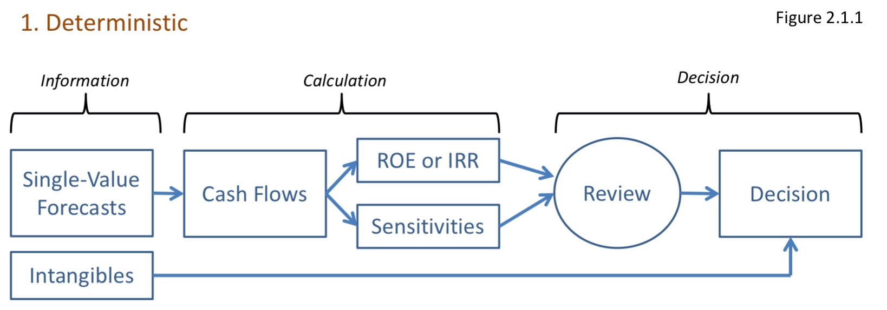
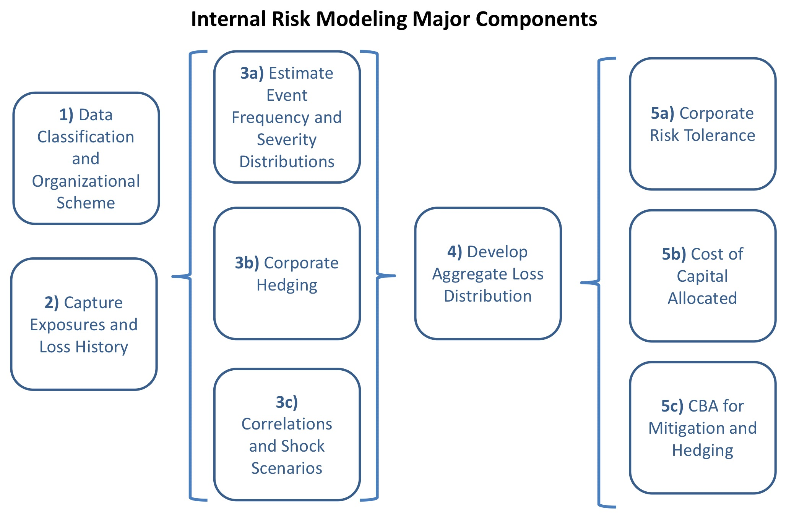

# C2 ERA 2.1 Corporate Decision Making Using an Enterprise Risk Model - Don Mango

## Cliff's Summary

3 evolutionary steps in decision analysis:  
[Deterministic](#deterministic) $\Rightarrow$ [Risk Analysis](#risk-analysis) $\Rightarrow$ [Cetainty Equivalent](#CE)

* [Argument](#argument-for-5) that 2^nd^ step is sufficient and [reasons](#step3-reason) to move to the 3^rd^ step

Attribute cost back to source of risk for decision making

[Quantify](#quantify-risk-t) corporate risk tolerance and what it is [dependent](#risk-t-dep) on

* [Spetzler](#spetzler): Benefits of utility curve
* [Walla](#walls): Calculates efficient frontier $\Rightarrow$ Estimate risk tolerance $\Rightarrow$ Where on the frontier to select the best portfolio based on $R$, utility curve and CE

[Allocating](#allocation) risk captial

Cost benefit analysis with EVA or capital allocation

Use a suite of decision metrics that are distinct and independent (to give different perspectives) and are responsive to different dynamics

## Evoluation of Corporate Decision Making Under Uncertainty

Decision making under uncertainty

3 evolutionary steps:

1) Deterministic Project Analysis:  
Forecast CF, return metric (e.g. NPV) and sensitivity

2) Risk Analysis:  
Disbtribution of inputs (e.g. Revenue) and distribution of outcome

3) Certainty Equivalent:  
From 2) run the outcomes through a risk preference function of the company

### Deterministic Project Analysis

Single deterministic forecast of cash flow  

Return metric using NPV or IRR  

Sensitivity on inputs (Rev, exp, CoC)

* Sensitivity doesn't have any probabilities for each scenarios

Uncertainty is handled judgmentally

### Risk Analysis

Critical inputs have a distribution (w/ correlations)  
$\hookrightarrow$ Output also a distribution of NPV or IRR

Uncertainty is handled judgmentally; *Good portion has been moved into the dist^n^*

***

 Argument that step 2 is sufficient (Current best practice 2007):

* Since investors are only compensated for systemic risk and not firm specific risk, no need to focus on firm specific risk

* Based on portfolio theory where investors holds many different firm so the firm specific risk are diversified away

$\hookrightarrow$ Only need to manage systemic risk

Counter argument:

* Management can't distinguish between systemic and firm risk
* Instantaneous risk (jump risk) is still present as information have a time lag
    * I.e. some risk has no time lage
    * Portfolio theory manages risk through discounting
* Market based information is too noisy for management to be able to do proper cost-benefit analysis and make trade off decisions

### Certainty Equivalent

Distribution output from risk analysis is input to a utility function for the firm

* Utility function is based on corporate risk policy

* Purpose is to express preference in a transparent and consistent manner

$\hookrightarrow$ Automate and formalizes some of the risk assessment, while risk judgement is still required

***

 Reasons to move to step 3:

Risk managers and owners are both interested in preserving franchise value  
$\hookrightarrow$ Want RM in place to protect FV  
$\hookrightarrow$ Both are interested in policy to help make risk management more **objective**, **consistent**, **repeatable**, and **transaparent**

* Market Value = Book Value + Franchise Value
* Franchise Value = Value of future earnings growth

## Decision Making with an IRM

Focus on Element 5 below, 1-4 discussed else where

**Attribute Cost Back to Source of Risk**

1) Estimate aggregate loss distribution (4 Above)

    * Distribution of outcomes for each LoB $\Rightarrow$ Correlate outcomes $\Rightarrow$ Correlate on external sources
    
2) Quantify the impact of the loss outcomes on the organization
    * Amount of P&L or level of PHS; Can be a distribution
    
3) Assign a cost to each amount of impact

    * Utility function will be non linear $\Rightarrow$ Higher cost to events further out in the tail
    
4) Attribute cost to source (e.g. BUs)

### 5a - Corporate Risk Tolerance

Corporate risk tolerance

* How much risk a company is willing to take
* How much fluctuation in annual results it is willing to bear
* Needed in Steps 2 and 3 above

 Corporate risk tolerance is dependent on:

* **Organization Size**: Depending how much capital a firm have to deploy to invest in project each year changes how big an investment is

* **Capital**: The % impact to the firm's total capital is more telling than the nominal value $\Rightarrow$ Firm with higher capital can tolerate bigger nominal value volatility

* **Volatility**:
    * Investors might want steady stream of dividend paid $\Rightarrow$ Lower risk tolerance
    * Public firms with quarterly earnings are rewarded for having consistent predictable profits $\Rightarrow$ Lower risk tolerance
    * Private firm can afford to have more volatile results
    
 **Risk Tolerance**

* Important to define firm's risk tolerance
* Can be defined by *Risk Preference Function* aka **Utility Function**
    * Non linear e.g. $U(x) = A + B \cdot \operatorname{ln}[x+c]$ or $U(x) = A - e^{ -x / R }$
    * Slope decrease further into profit while increases further into losses
    
#### Spetzler

"The Development of Corporate Risk Policy for Capital Investment Decisions" - Spetzler 1968

Paper found that managers have very different risk tolerate and found that they are likely to be too conservative for small projects (damages not meaningful to the firm as a whole)

Useful for management to 1) see the different utility curves for different managers 2) make decisions on where the company utility curve should be and communicate that to the day to day decision makers

**Benefits of Utility Curve**:

* Transparent, objective mathematical expression of the firm's acceptable risk/reward trade offs

* Without, risk/reward decisions criteria will be inconsistent and opaque and driven by individuals

#### Walls

"Combining decision analysis and portfolio management to improve project selection in the exploration and production firm" - Walls 2004

Calculates efficient frontier $\Rightarrow$ Estimate risk tolerance $\Rightarrow$ Where on the frontier to select the best portfolio

**Efficient Frontier**

Given $n$ projects with $\operatorname{E}[NPV_i]$ and $\sigma_i$, the firm can choose to participate on each project with % $x_i$

Given the budget based on current portfolio, an efficient frontier is built based on the lowest portfolio $\sigma$ given different expected NPVs

* They note that the current portfolio is not optimal

The next 3 point is to decide where on the efficient frontier to be on

**Risk Tolerance**

Risk tolerance level $R$ and utility function tells you where the firm choose to be on the efficient frontier

* $R$ is estimated based on where the decision maker is indifferent from a gamble of 50% of $R$ and 50% of $-R/2$ and not taking it

**Utility Function**

$U(x) = 1 - e^{ - x / R}$

* Tell us how much risk is the firm willing to tolerate; How much reward are we willing to give up for a given reduction in risk and vice versa

**Certainty Equivalent**

With the above, calculate Certainty Equivalent (CE) of a given *portfolio*:

* CE = The fixed amount that the firm is indifferent between taking the risky portfolio or the fixed amount

CE changes based on the $R$ selected

* Pick the portfolio with the highest CE
* Negative CE means the firm would be better of not investing in it

***

Firm must answer these questions:

* How much risk are we willing to tolerate (Picking $R$)
* How much reward are we willing to give up for a given reduction of risk and vice versa (Selection of utility curve)
* Are the risk-reward trade offs available along the efficient frontier acceptable to us (Answer by the first 2 points)

### 5b - Cost of Capital Allocated

Still an open question

*Risk Capital**

Risk capital is a measure of firm's total risk bearing capacity and is only an aggregate measure. It gives counterparty confidence that the financial firm can perform

**Allocation**

Cost of risk capital is being allocated, not the capital itself

Allocation of risk capital is theoretical since no capital is actually transferred to the policy

Useful to allocate risk capital to risk-taking units (and non risk-taking units too maybe)

* Total risk capital required is reduced by diversification benefits and the contributions to risk are not linear (See ERA 2.2)

Difficult to allocate risk measure to different units, one method below:

* Return on Risk Adjusted Capital (RORAC)
* Allocate capital in a risk adjusted way $\Rightarrow$ Riskier sources require more capital
* Apply firm wide hurdle rate to determine cost of capital for each BU
* $\neq$ RAROC as RAROC adjusts the hurdle rate and does not risk adjust capital

**Bypassing Allocation**

Mango argues that concept of allocating capital is meaningless as each risk source has access to the capital of the firm

* Focus on cost of capital the risk source uses we get a direct answer

* Bypass allocation and goes straight to the cost

* How to determine the cost is the difficult part

**EVA**

EVA = Economic Value Added = NPV - Cost of Capital

EVA > 0 means BU is adding value

### 5c - CBA for Mitigation

Cost-benefit analysis (CBA)

EVA

* Mitigation effort that has positive EVA should be done

Capital Allocation

* Projects that reduce capital cost by more than the cost of the project should be undertaken

## Conclusion

Difficult to perform risk management for a firm based on a single metric

Recommend a suite of decision metrics that are distinct and independent (to give different perspectives) and are responsive to different dynamics

Parsimony dictates that reduce complexity as much as possible, but not more so

$\therefore$ using a handful of risk metrics is acceptable
